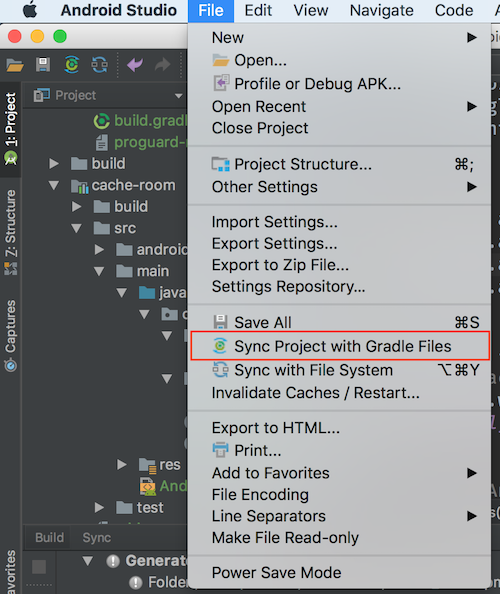

# Android Template

A template for new Android projects at Raizlabs using Clean Architecture. As this repo is public for the Android communtity, **avoid referencing client names in commit messages, issues, PRs, etc.**

Inspired by [thoughtbot]/[android-template]

[thoughtbot]: https://thoughtbot.com/
[android-template]: https://github.com/thoughtbot/android-template

## What's in the template?

 - Configures the company name, project name, repo name, package name, and gitignore.
 - Option to use [Room](https://developer.android.com/topic/libraries/architecture/room) or [Realm](https://realm.io/).
 - Default set of standard Android libraries including Kotlin, Rx, Dagger, Retrofit, Moshi, and Timber. View the [dependencies reference](https://github.com/Raizlabs/android-template/blob/develop/README.md#dependencies-reference) for a complete list.
 - Modules for separation of concerns in accordance with Clean Architecture.
 - Proguard configuration.
 - CircleCi configuration.
 - Signing configs and products flavors for `develop`, `sprint`, and `beta` tracks.
 - Commit hook to format code.
 - [HockeyApp](https://www.hockeyapp.net/) deploy [configuration](%7B%7B%20cookiecutter.repo_name%20%7D%7D/gradle/deploy.gradle).
 
## Contributing
We would love your help! View the [contributing guide](./contributing.md) to get started.

## Usage
1. [Install cookiecutter:](http://cookiecutter.readthedocs.io/en/latest/installation.html)
    * Mac OS: `brew install cookiecutter`
    * Debian/Ubuntu: `sudo apt-get install cookiecutter`
2. [Run cookiecutter against the template:](http://cookiecutter.readthedocs.io/en/latest/usage.html)
    * Against GitHub repo: `cookiecutter gh:raizlabs/android-template`
      * Specify a branch: `cookiecutter git@github.com:Raizlabs/android-template.git --checkout {name_of_branch}`
    * Local copy: `cookiecutter {path/to/android_template_project}`
3. Configure the project properties in the prompt.
4. Delete anything that is not of interest to your project.

## Post Generation
There are a number things that you still need to take care of to get your newly generated project up and running:
1. Enter `./gradlew configureGitHooks` into the terminal to take advantage of the pre-defined git hooks.
2. Run Gradle Sync in Android Studio to make sure you can build the project.
3. Generate 3 keystores for your project:
    * Generate a keystore for the develop, sprint and beta tracks
    * Make sure to add the actual keystore files to the repository
    * **DO NOT SAVE THE KEYSTORE CREDENTIALS TO THE REPO, USE 1PASSWORD!**
    * Utilize the same credentials for all 3 keystores to reduce complexity
    * Try to follow the convention of app name and build flavor for the alias:
        * For example: `doormanDevelop`, `doormanSprint` and `doormanBeta`
    * Update the `app/build.gradle` file to reflect these keystore values
4. Set your project up on CircleCI
5. Add the following environment variables to CircleCI **(A note on the following environment variables: they are prefixed with `ORG_GRADLE_PROJECT_` so they can be accessed within our Gradle scripts as project properties. This makes it easier for us to fake them outside of a CI environment.)**
    * `ORG_GRADLE_PROJECT_HOCKEYAPP_TOKEN` set to Raizlabs' HockeyApp token
    * The IDs for each of the tracks being deployed to HockeyApp:
        * `ORG_GRADLE_PROJECT_HOCKEYAPP_ID_DEVELOP` set to the develop track's HockeyApp ID
        * `ORG_GRADLE_PROJECT_HOCKEYAPP_ID_SPRINT` set to the sprint track's HockeyApp ID
        * Beta is optional*
    * `ORG_GRADLE_PROJECT_KEY_PASSWORD` set to the keystores' key password
    * `ORG_GRADLE_PROJECT_STORE_PASSWORD` set to the keystores' store password
    * Any keys that we don't want living in the repo

### How to deal with post-generation build woes
1. If you decided to launch Android Studio simply click `File > Sync Project with Gradle Files` to generate a `local.properties` file.

    
2. If you decided not to launch Android Studio you need to make sure various environment variables are set before you can run any Gradle scripts:
    * You can set the following environment variables with the `export` command in the terminal
        * `ANDROID_HOME`=`/Users/{your_user}/Library/Android/sdk`
        * `JAVA_HOME`=`/Applications/Android\ Studio.app/Contents/jre/jdk/Contents/Home/` _(This only needs to be set if you have multiple versions of Java on your machine.)_

## Dependencies Reference
- [Kotlin](https://kotlinlang.org/docs/reference/using-gradle.html): Kotlin is a modern statically typed programming language that will boost your productivity and increase your developer happiness.
- [Ktlint](https://github.com/shyiko/ktlint): An anti-bikeshedding Kotlin linter with built-in formatter
- [Rx](https://github.com/ReactiveX/RxAndroid): Makes writing reactive components in Android applications easy and hassle-free.
- [RxBinding](https://github.com/JakeWharton/RxBinding): RxJava binding APIs for Android's UI widgets. 
- [Dagger](https://github.com/google/dagger): Dagger is a fully static, compile-time dependency injection framework for both Java and Android.
- [Retrofit](https://github.com/square/retrofit): Type-safe HTTP client for Android and Java.
- [Moshi](https://github.com/square/moshi): Moshi is a modern JSON library for Android and Java. It makes it easy to parse JSON into Java objects.
- [Kotshi](https://github.com/ansman/kotshi): An annotations processor that generates Moshi adapters from immutable Kotlin data classes.
- [Timber](https://github.com/JakeWharton/timber): A logger with a small, extensible API which provides utility on top of Android's normal Log class. 
- [Okhttp](https://github.com/square/okhttp): An HTTP+HTTP/2 client for Android and Java applications.
- [arch](https://developer.android.com/topic/libraries/architecture/): Android architecture components are part of [Android Jetpack](https://developer.android.com/jetpack). They are a collection of libraries that help you design robust, testable, and maintainable apps. Start with classes for managing your UI component lifecycle and handling data persistence. We included [room](https://developer.android.com/topic/libraries/architecture/room) and [viewmodel](https://developer.android.com/topic/libraries/architecture/viewmodel) only for demonstration purposes.
- [atsl](https://developer.android.com/training/testing/set-up-project): Dependencies needed for running Android tests.
- [espresso](https://developer.android.com/training/testing/espresso/): Use Espresso to write concise, beautiful, and reliable Android UI tests.
- [mockito](https://github.com/mockito/mockito): Mocking framework for unit tests in Java.
- [android-ktx](https://github.com/android/android-ktx): A set of Kotlin extensions for Android app development. The goal of Android KTX is to make Android development with Kotlin more concise, pleasant, and idiomatic by leveraging the features of the language such as extension functions/properties, lambdas, named parameters, and parameter defaults.
- [RxPermissions](https://github.com/tbruyelle/RxPermissions): This library allows the usage of RxJava with the new Android M permission model.
- [RxRelay](https://github.com/JakeWharton/RxRelay): Relays are RxJava types which are both an Observable and a Consumer.
- [AutoDispose](https://github.com/uber/AutoDispose):AutoDispose is an RxJava 2 tool for automatically binding the execution of RxJava 2 streams to a provided scope via disposal/cancellation.
- [junit](https://github.com/junit-team/junit4): JUnit is a simple framework to write repeatable tests. It is an instance of the xUnit architecture for unit testing frameworks.
- [assertj-core](https://github.com/joel-costigliola/assertj-core): AssertJ provides a rich and intuitive set of strongly-typed assertions to use for unit testing (with JUnit, TestNG or any other test framework).
- [dexmaker](https://github.com/linkedin/dexmaker): A Java-language API for doing compile time or runtime code generation targeting the Dalvik VM.
